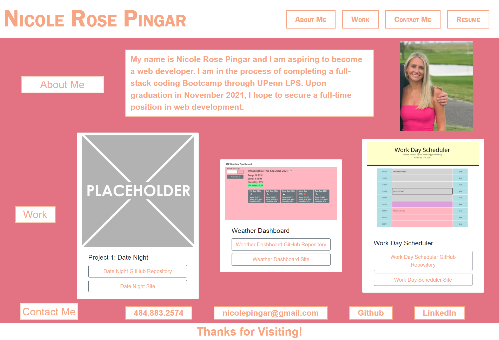

# portfolio_nrp_refactor

# Nicole Pingar Portfolio

## Description
I have created a portfolio page to showcase my skills and talents. The portfolio is a work-in-progress and includes three of my deployed web applications. It also includes a link to my resume, GitHub and LinkedIn as well as my contact information. Through the creation of my portfolio, I have learned how to successfully use Bootstrap to style and position a web application.

## Usage
Please click this link to view my portfolio: https://nicolepingar.github.io/portfolio_nrp_refactor/

Below is a picture of my portfolio:

## How to Contribute
Please find me on GitHub @nicolepingar or email me at nicolepingar@gmail.com.